<div align="center">


<br/>

[](https://www.python.org/)
[](https://www.djangoproject.com/)
[](https://www.django-rest-framework.org/)
[](https://nextjs.org/)
[](https://react.dev/)
[](https://www.typescriptlang.org/)

[](https://www.postgresql.org/)
[](https://redis.io/)
[](https://docs.celeryq.dev/)
[](https://tailwindcss.com/)
[](https://ollama.com/)
[](https://github.com/SYSTRAN/faster-whisper)

<br/>

[](https://opensource.org/licenses/MIT)
[](http://makeapullrequest.com)
[]()
[]()

<!-- Dynamic GitHub badges — update live once the repo is pushed. -->
[](https://github.com/Sridhar08-glitch/MeetingMind-AI/stargazers)
[](https://github.com/Sridhar08-glitch/MeetingMind-AI/network/members)
[](https://github.com/Sridhar08-glitch/MeetingMind-AI/issues)
[](https://github.com/Sridhar08-glitch/MeetingMind-AI/commits)

<br/>

<a href="#-quick-start"></a>
&nbsp;
<a href="#-architecture"></a>
&nbsp;
<a href="https://github.com/Sridhar08-glitch/MeetingMind-AI/issues"></a>

</div>

---

## 📋 Table of Contents

- [📖 Overview](#-overview)
- [⚙️ How It Works](#️-how-it-works)
- [✨ Key Features](#-key-features)
- [🧩 Capability Modules](#-capability-modules)
- [🛠️ Technology Stack](#️-technology-stack)
- [🧠 The AI Stack](#-the-ai-stack)
- [🏗️ Architecture](#️-architecture)
- [⚙️ Processing Pipeline](#️-processing-pipeline)
- [🗂️ Project Structure](#️-project-structure)
- [⚡ Quick Start](#-quick-start)
- [🔧 Environment Variables](#-environment-variables)
- [🔌 API Overview](#-api-overview)
- [🔐 Security & Privacy](#-security--privacy)
- [📸 Screenshots](#-screenshots)
- [🗺️ Roadmap](#️-roadmap)
- [🤝 Contributing](#-contributing)
- [👨‍💻 Author](#-author)
- [📜 License](#-license)

---

## 📖 Overview

<div align="center">
  
  
  
  
</div>

<br/>

**MeetingMind AI** is a fully **local, private, AI meeting-intelligence platform**. Upload (or import) a recording and MeetingMind transcribes it, summarizes it, extracts action items / decisions / risks, identifies who spoke, answers questions about it, rolls everything into an organization-wide **Knowledge Hub**, and puts a team of specialized **AI agents** on top — **end-to-end on your own machine, with no paid APIs and no data ever leaving your computer.**

> 💡 **Free & open-source by design.** Every AI capability runs on local software — **Faster-Whisper** (speech-to-text), **Ollama** (LLM + embeddings), **SpeechBrain ECAPA** (speaker diarization), FFmpeg, PostgreSQL and Redis. Cloud AI providers (OpenAI / Anthropic) are *optional* and never required.

### Why MeetingMind AI?

| The Problem | The MeetingMind Solution |
|-------------|--------------------------|
| 🎙️ Hours of meeting audio nobody re-listens to | Local Faster-Whisper transcription with word-level, editable transcripts |
| 📝 Action items & decisions lost after the call | A grounded local LLM extracts tasks, decisions, risks & follow-ups — with citations |
| ☁️ SaaS meeting tools send your data to the cloud | 100% local pipeline — your recordings never leave your machine |
| 🧠 Every meeting is an isolated island | A bitemporal **Knowledge Hub** links facts across meetings and remembers *when* you knew them |
| 🙋 "Who said that? Who owns this task?" | First-class **Speaker Diarization & Identity** — recognizes the same voice across meetings |
| 📊 No visibility into org health & trends | An **Executive Intelligence** layer materializes health scores, trends, predictions & alerts |

---

## ⚙️ How It Works

<div align="center">
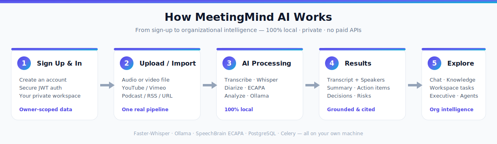
</div>

> 📖 **Full walkthrough:** see **[docs/WORKFLOW.md](docs/WORKFLOW.md)** for a screen-by-screen tour — from registration through transcripts, speaker identity, workspace, knowledge, executive intelligence and AI agents.

---

## ✨ Key Features

<table>
<tr>
<td width="50%">

### 🎧 Capture & Transcribe
- Secure upload (magic-byte MIME check, SHA-256 dedup, versioned files)
- **Universal media import** — YouTube/Vimeo, direct MP3/MP4, podcast/RSS
- Local **Faster-Whisper** STT with word-level, editable segments
- Multi-language detection & transcription

</td>
<td width="50%">

### 🧠 Understand & Act
- One grounded LLM inference → summary, action items, decisions, risks
- **Human-in-the-loop** — AI *suggests*, you approve into a Kanban workspace
- **Meeting Chat (RAG)** — grounded, cited Q&A over a single meeting
- Never hallucinated — answers only from the transcript, else "not found"

</td>
</tr>
<tr>
<td width="50%">

### 🗣️ Speaker Intelligence
- **Speaker diarization** (token-free SpeechBrain ECAPA, optional pyannote)
- First-class Speaker entities + editable identity cards
- **VoicePerson registry** — cross-meeting voice recognition ("Looks like Alex — 96%")
- Tiered, suggestion-only matching — nothing auto-linked

</td>
<td width="50%">

### 📚 Remember & Decide
- Bitemporal, **event-sourced Knowledge Hub** (what you knew, and when)
- Org search, cross-meeting chat, time-travel, timelines, consensus & conflicts
- **Executive Intelligence** — health, score, analytics, recommendations, alerts
- **Multi-agent platform** — 12 agents, a Planner, and a Collaboration engine

</td>
</tr>
</table>

---

## 🧩 Capability Modules

<div align="center">

| # | Module | Description | Status |
|---|--------|-------------|:------:|
| 🔐 1 | **Authentication** | JWT auth (register/login/refresh/reset), owner-scoping everywhere | ✅ |
| 📤 2 | **Meeting Upload** | Secure validated upload, versioning, private UUID storage | ✅ |
| ⚙️ 3 | **Processing Engine** | Generic job + pipeline engine (retries, resume, cancel, live timeline) | ✅ |
| 🎙️ 4 | **Local Speech-to-Text** | Faster-Whisper, selectable models, inline editing, TXT/SRT/VTT export | ✅ |
| 🧠 5 | **Local AI Analysis** | Grounded summaries, action items, decisions, risks, keywords (versioned) | ✅ |
| 💬 6 | **Meeting Chat (RAG)** | Cited, grounded Q&A over a single meeting | ✅ |
| 🗂️ 7 | **Workspace** | Kanban tasks, issues, decisions, risks, notes, reports + AI approvals | ✅ |
| 🌐 8 | **Knowledge Hub** | Bitemporal org index, cross-meeting chat, time-travel, reliability, consensus | ✅ |
| 📈 9 | **Executive Intelligence** | Health/score, analytics, recommendations, alerts, trends, predictions | ✅ |
| 🧭 10 | **Copilot & Command Palette** | AI workspace home, ⌘K palette, "explain" mode | ✅ |
| 🤖 11 | **Multi-Agent Platform** | 12 declarative agents, reputation-weighted Planner, Collaboration engine | ✅ |
| 🔴 12 | **Live Recording & Translation** | Real-time capture pipeline + transcript translation | ✅ |
| 🎬 13 | **Universal Media Import** | Import public video/podcast/RSS/direct URLs through the real pipeline | ✅ |
| 🗣️ 14 | **Speaker Diarization & Identity** | Speakers, embeddings, VoicePerson cross-meeting recognition, benchmarking | ✅ |

</div>

---

## 🛠️ Technology Stack

<table>
<tr>
<th align="center">🔙 Backend</th>
<th align="center">🖥️ Frontend</th>
<th align="center">🗄️ Data & Infra</th>
</tr>
<tr>
<td valign="top">

- **Python 3.12**
- **Django 5.1** + **DRF 3.15**
- **SimpleJWT** (auth + blacklist)
- **Celery 5.4** (async jobs)
- **Django Channels** (live WebSockets)
- **drf-spectacular** (OpenAPI docs)
- Clean, layered architecture

</td>
<td valign="top">

- **Next.js 16** (App Router)
- **React 19** + **TypeScript 5**
- **Tailwind CSS 4**
- **TanStack Query 5**
- **Zustand 5** (state)
- **react-hook-form** + **zod**
- **lucide-react** (icons)

</td>
<td valign="top">

- **PostgreSQL 16**
- **Redis** (cache + Celery broker)
- **FFmpeg** (audio extraction)
- **yt-dlp** + **feedparser** (import)
- **Gunicorn / Uvicorn**
- **Docker** (optional)
- **Pytest** (test suite)

</td>
</tr>
</table>

---

## 🧠 The AI Stack

> Everything runs **locally and free**. Providers are swappable via a settings-driven interface (`LLMProvider` / `SpeechToTextProvider` / `EmbeddingProvider` / `DiarizationProvider`).

| Capability | Local Engine | Notes |
|------------|--------------|-------|
| 🎙️ **Speech-to-Text** | `Faster-Whisper` (base, CPU int8) | Word-level segments, language detection |
| 🧠 **LLM (analysis + chat)** | `Ollama` · `llama3.2:3b` | Grounded JSON output, retry + deterministic fallback |
| 🔎 **Embeddings (RAG)** | `Ollama` · `nomic-embed-text` | Hybrid semantic + keyword retrieval |
| 🗣️ **Diarization** | `SpeechBrain ECAPA` (token-free) | Optional `pyannote` for higher accuracy |
| 🎬 **Media extraction** | `FFmpeg` / `ffprobe` | Extraction + 16 kHz normalization |
| ☁️ **Optional cloud** | OpenAI / Anthropic | Never required — off by default |

---

## 🏗️ Architecture

MeetingMind follows a **clean, layered architecture** per Django app, with a generic pipeline engine and an in-process event bus tying the domains together.

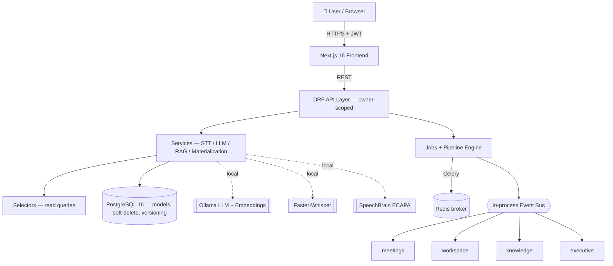

**Cross-cutting mechanisms**

- **Provider abstraction** — Ollama / Faster-Whisper / ECAPA are selected by settings (dependency inversion → enables the local-first mandate).
- **Generic job + pipeline engine** (`apps/jobs`) — self-registering stages, dependency-DAG ordering, retries, idempotent resume, cancellation.
- **In-process event bus** — job/stage lifecycle events; `meetings` / `workspace` / `knowledge` / `executive` subscribe to materialize their own state.
- **Bitemporal knowledge index** — event-sourced, versioned facts (valid-time + transaction-time), so nothing is ever silently overwritten.

---

## ⚙️ Processing Pipeline

Every recording flows through one idempotent, resumable pipeline:

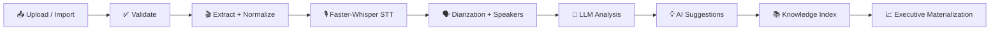

---

## 🗂️ Project Structure

```
MeetingMind-AI/
│
├── 📁 backend/                     # Django 5.1 + DRF API
│   ├── 📁 config/                  # settings, URLs, ASGI/WSGI, Celery
│   ├── 📁 apps/
│   │   ├── 📁 common/              # base models, storage, responses, demo
│   │   ├── 📁 accounts/            # JWT auth & users
│   │   ├── 📁 jobs/                # generic job + pipeline engine
│   │   ├── 📁 meetings/            # upload, STT, AI, chat, diarization
│   │   ├── 📁 workspace/           # tasks, decisions, risks, VoicePerson
│   │   ├── 📁 knowledge/           # bitemporal knowledge hub + executive
│   │   ├── 📁 agents/              # multi-agent platform + planner
│   │   └── 📁 benchmarks/          # diarization evaluation framework
│   ├── 📄 manage.py
│   └── 📄 requirements.txt
│
├── 📁 frontend/                    # Next.js 16 + React 19 app
│   ├── 📁 src/app/(dashboard)/     # Copilot, meetings, workspace, knowledge…
│   ├── 📁 src/components/          # UI, panels, graphs, command palette
│   ├── 📁 src/lib/api/             # typed API clients
│   ├── 📁 src/hooks/ 📁 src/store/ # React Query hooks + Zustand stores
│   └── 📄 package.json
│
├── 📁 docs/                        # architecture, guides, deployment
├── 📄 CHANGELOG.md
├── 📄 LICENSE
└── 📄 README.md
```

---

## ⚡ Quick Start

### Prerequisites


### 1️⃣ Clone

```bash
git clone https://github.com/Sridhar08-glitch/MeetingMind-AI.git
cd MeetingMind-AI
```

### 2️⃣ Local AI models (Ollama)

```bash
# Install Ollama from https://ollama.com, then pull the local models:
ollama pull llama3.2:3b
ollama pull nomic-embed-text
```

### 3️⃣ Backend (Django)

```bash
cd backend
python -m venv venv

# Windows
venv\Scripts\activate
# macOS / Linux
source venv/bin/activate

pip install -r requirements.txt
pip install -r requirements-stt.txt        # Faster-Whisper (optional but recommended)

# Create your environment file from the template, then EDIT it (see below)
cp .env.example .env

python manage.py migrate
python manage.py createsuperuser
python manage.py runserver
```

> ✅ Backend runs at **http://localhost:8000** · API docs at **/api/docs/**

### 4️⃣ Frontend (Next.js)

```bash
cd frontend
npm install

# Point the frontend at your backend
echo "NEXT_PUBLIC_API_BASE_URL=http://127.0.0.1:8000/api" > .env.local

npm run dev
```

> ✅ Frontend runs at **http://localhost:3000**

### 5️⃣ (Optional) Seed a demo workspace

```bash
cd backend
python manage.py create_demo          # generates real media + runs the real pipeline
```

---

## 🔧 Environment Variables

> ⚠️ **Never commit real secrets.** The values below are **placeholders** — create your own in `backend/.env` (copied from `.env.example`). `.env` is git-ignored; only `.env.example` (with placeholders) should be committed.

```env
# ── Django ──────────────────────────────────────────────
DJANGO_SECRET_KEY=<generate-a-long-random-50-char-string>
DEBUG=True
ALLOWED_HOSTS=localhost,127.0.0.1

# ── Database (PostgreSQL) ───────────────────────────────
DB_ENGINE=postgres
DB_NAME=meetingmind
DB_USER=postgres
DB_PASSWORD=<your-own-postgres-password>   # set your own — do not reuse examples
DB_HOST=127.0.0.1
DB_PORT=5432

# ── AI providers (all local by default) ─────────────────
AI_PROVIDER=ollama
EMBEDDING_PROVIDER=ollama
STT_PROVIDER=faster_whisper
OLLAMA_BASE_URL=http://localhost:11434

# ── Media / audio ───────────────────────────────────────
FFMPEG_BINARY=ffmpeg
FFPROBE_BINARY=ffprobe

# ── Background processing ───────────────────────────────
CELERY_TASK_ALWAYS_EAGER=False    # True = run inline without Redis
REDIS_URL=redis://127.0.0.1:6379/0
```

> 💡 **Generate a secret key:** `python -c "import secrets; print(secrets.token_urlsafe(50))"`

---

## 🔌 API Overview

The backend exposes a fully documented REST API (OpenAPI 3 via drf-spectacular):

```
http://localhost:8000/api/docs/        # Swagger UI
http://localhost:8000/api/schema/      # OpenAPI schema
http://localhost:8000/admin/           # Django admin
```

**Representative endpoints**

```http
# Auth
POST   /api/auth/login/                       # obtain JWT tokens
POST   /api/auth/token/refresh/               # refresh access token

# Meetings
POST   /api/meetings/upload/                  # upload + queue processing
GET    /api/meetings/{id}/transcript/         # transcript + speakers
GET    /api/meetings/{id}/ai/                 # AI analysis
POST   /api/meetings/conversations/{id}/ask/  # grounded meeting chat

# Speaker identity
GET    /api/workspace/voice-people/           # cross-meeting identities
GET    /api/workspace/voice-people/candidates/?speaker={id}   # match suggestions

# Knowledge & Executive
POST   /api/knowledge/chat/                   # cross-meeting org chat
GET    /api/knowledge/executive/dashboard/    # materialized exec dashboard

# Agents
POST   /api/agents/run/                        # run a single agent
POST   /api/agents/planner/run/                # multi-agent planner
```

---

## 🔐 Security & Privacy

| Control | Implementation |
|---------|----------------|
| 🔑 **Authentication** | JWT (SimpleJWT) with refresh + logout blacklist |
| 🧍 **Owner scoping** | Every query is filtered to the authenticated user — no cross-tenant leakage |
| 📤 **Upload safety** | Magic-byte MIME sniffing, size/duration limits, SHA-256 checksums, UUID filenames |
| 🕳️ **SSRF protection** | Media import blocks private/loopback/link-local IPs; public content only |
| 🧯 **No data exfiltration** | STT, LLM, embeddings & diarization all run locally — nothing leaves the machine |
| 🗄️ **SQL injection** | ORM-only queries; no raw SQL on user input |
| 🛡️ **XSS** | No `dangerouslySetInnerHTML`; Markdown links sanitized to safe schemes |

---

## 📸 Screenshots

<div align="center">

### 🧭 Copilot — AI Workspace Home
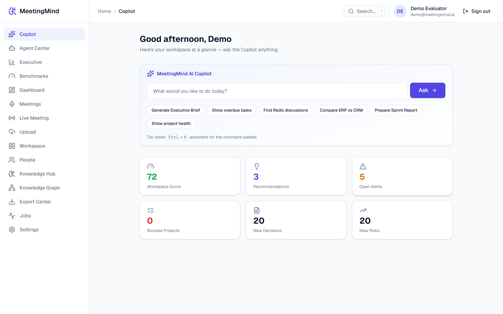

</div>

### 🎙️ Meetings

<table>
<tr>
<td align="center" width="50%"><b>📚 Meetings Library</b></td>
<td align="center" width="50%"><b>📤 Upload &amp; Media Import</b></td>
</tr>
<tr>
<td>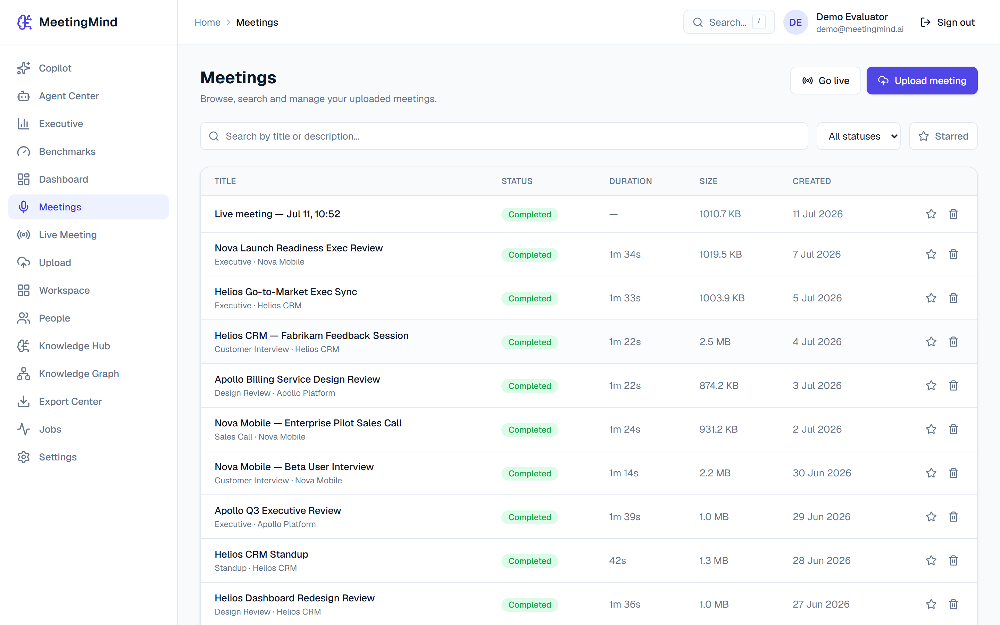</td>
<td>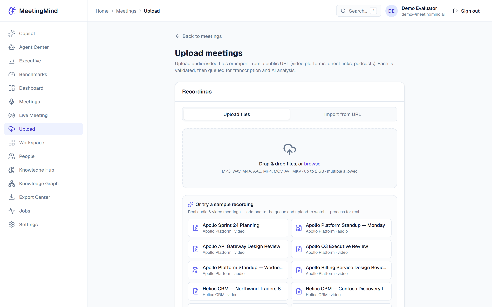</td>
</tr>
</table>

<div align="center">
<b>🧾 Meeting Detail — Transcript · AI Insights · Speakers · Chat</b><br/>
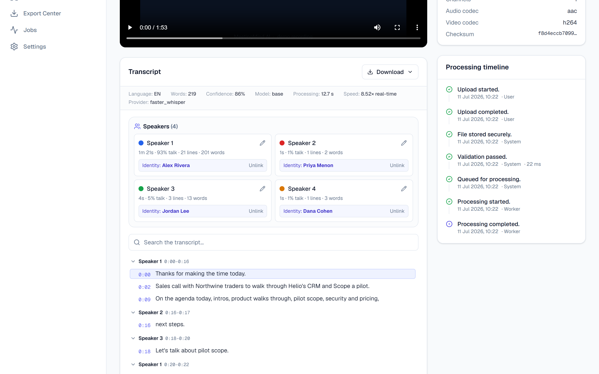
</div>

### 🗂️ Workspace &amp; 🗣️ Speaker Intelligence

<table>
<tr>
<td align="center" width="50%"><b>Workspace — Kanban &amp; AI Approvals</b></td>
<td align="center" width="50%"><b>People — Cross-Meeting Voice Identities</b></td>
</tr>
<tr>
<td>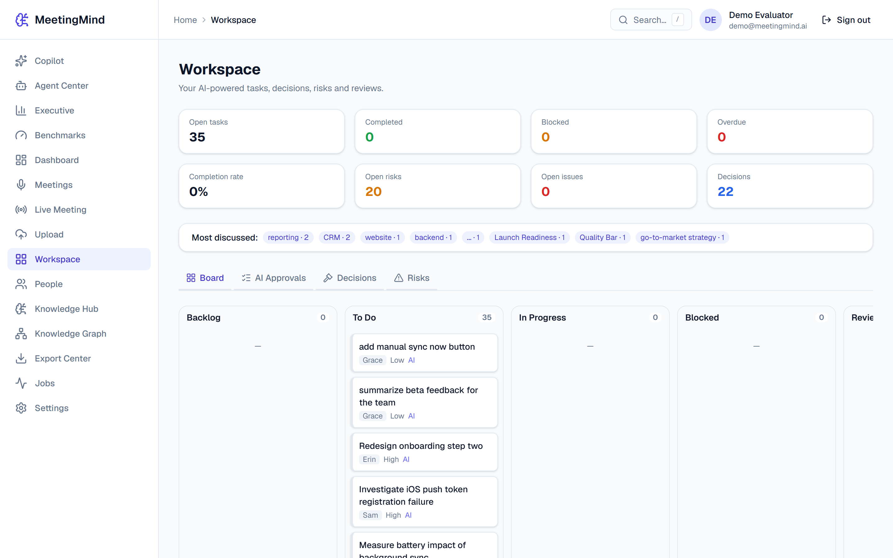</td>
<td>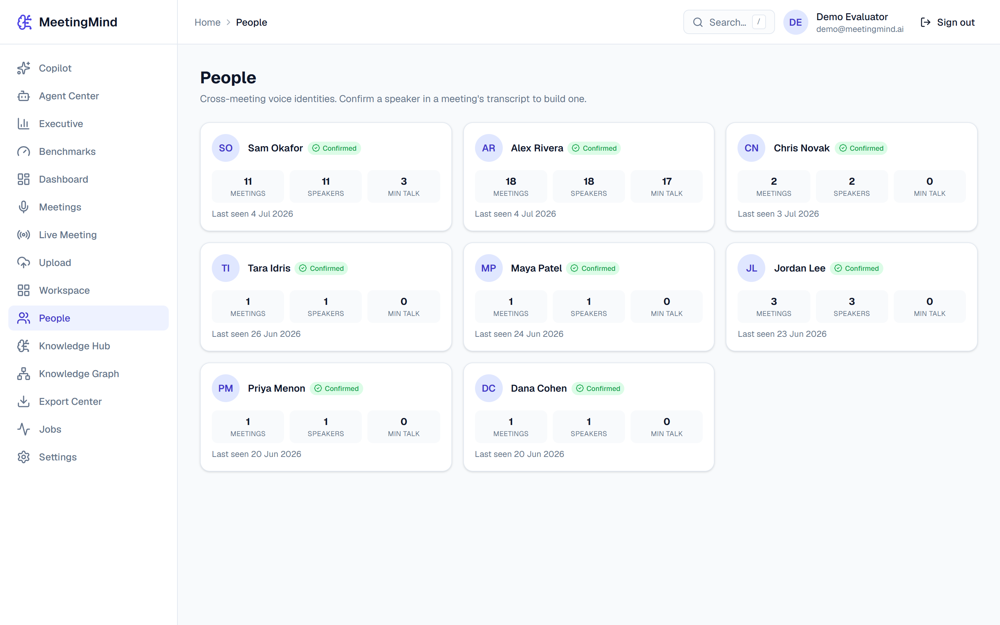</td>
</tr>
</table>

### 🌐 Knowledge Hub

<table>
<tr>
<td align="center" width="50%"><b>Org Search &amp; Cross-Meeting Chat</b></td>
<td align="center" width="50%"><b>Knowledge / People Graph</b></td>
</tr>
<tr>
<td>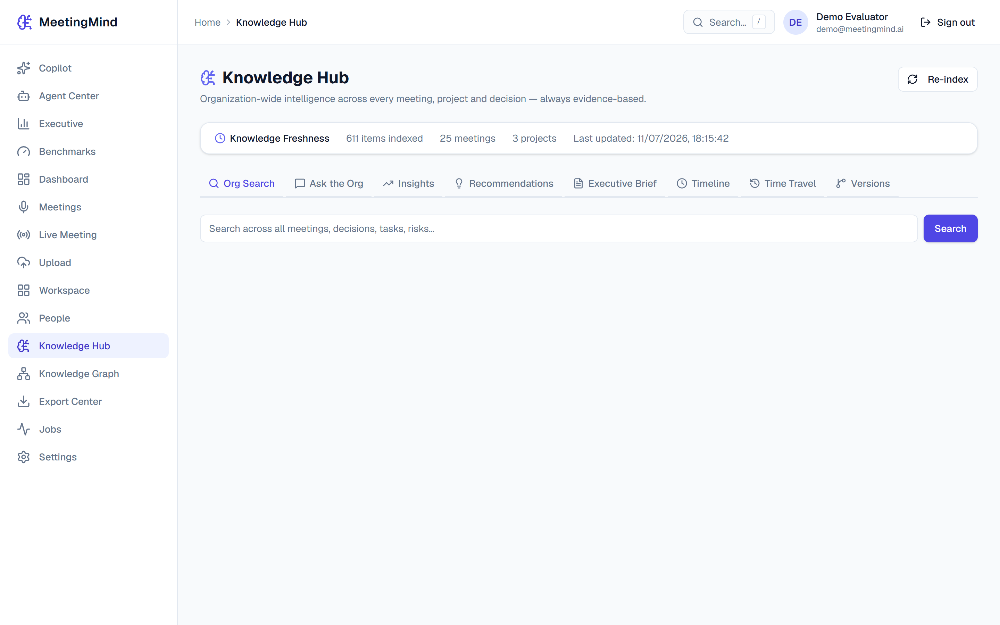</td>
<td>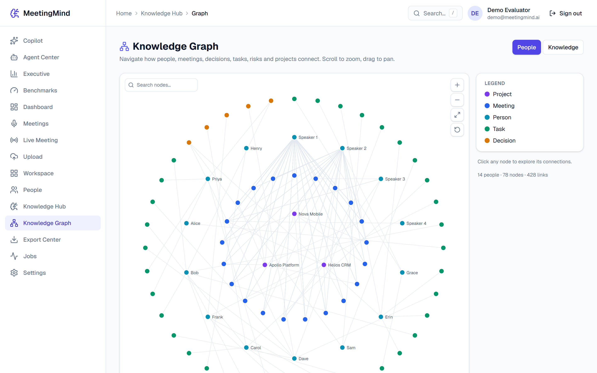</td>
</tr>
</table>

### 📈 Executive Intelligence &amp; 🤖 AI Agents

<table>
<tr>
<td align="center" width="50%"><b>Executive Dashboard</b></td>
<td align="center" width="50%"><b>AI Agent Center</b></td>
</tr>
<tr>
<td>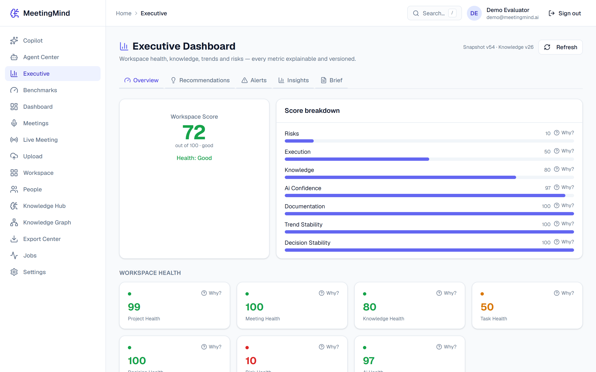</td>
<td>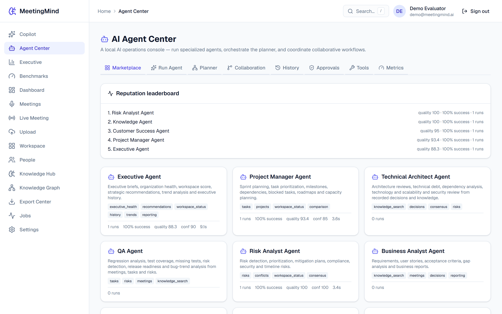</td>
</tr>
</table>

### 🔐 Sign In · ⚙️ Settings · 🌙 Dark Mode · 📱 Mobile

<table>
<tr>
<td align="center" width="28%"><b>Login</b></td>
<td align="center" width="28%"><b>Settings</b></td>
<td align="center" width="28%"><b>Dark Mode</b></td>
<td align="center" width="16%"><b>Mobile</b></td>
</tr>
<tr>
<td>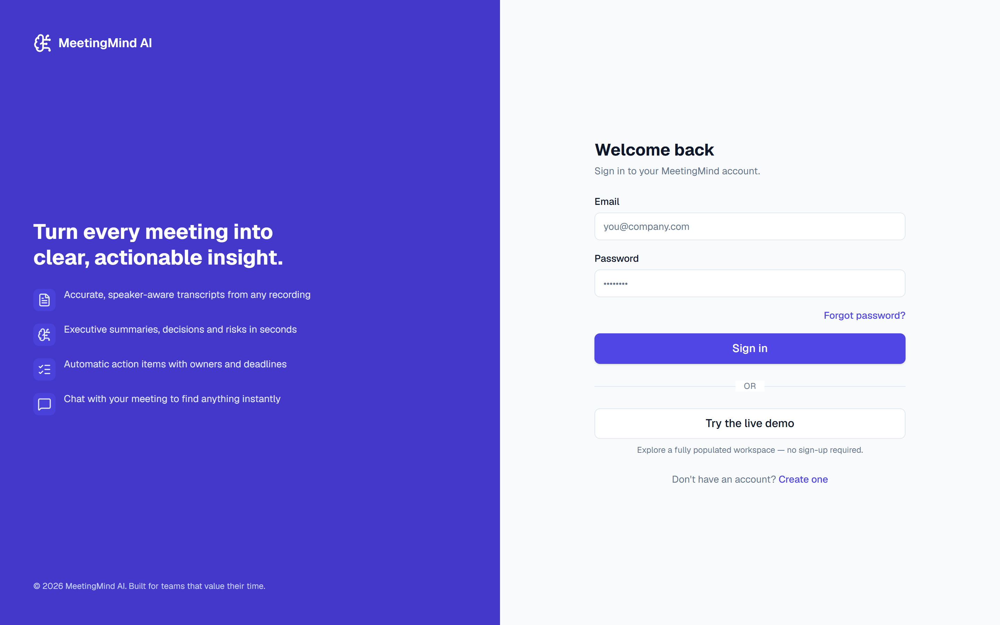</td>
<td>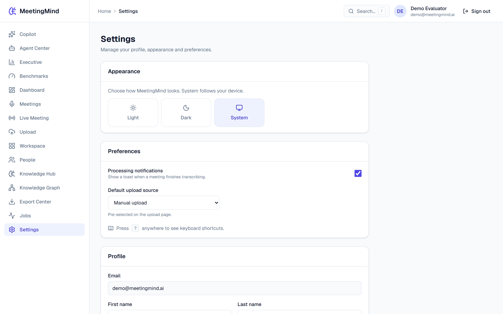</td>
<td>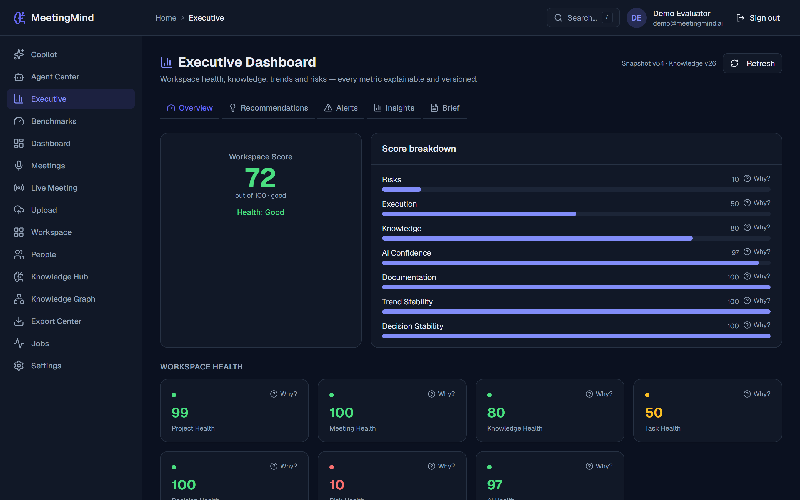</td>
<td>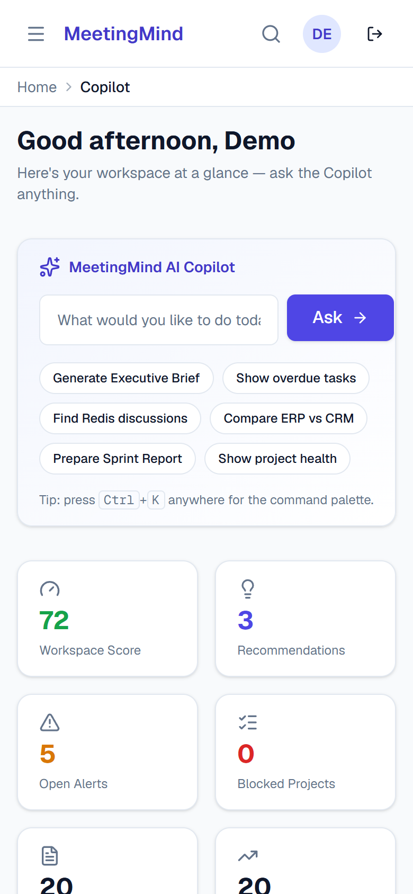</td>
</tr>
</table>

> 📷 All screenshots are captured live from the running app with the seeded demo workspace.

---

## 🗺️ Roadmap

- [x] **Phase 1–14** — Core platform, Knowledge Hub, Executive Intelligence, Agents, Live capture, Media import
- [x] **Phase 15** — Speaker diarization, identity & cross-meeting recognition (VoicePerson)
- [ ] **Speaker Intelligence** — participation, talk-time & decision-ownership analytics
- [ ] **Enterprise integrations (optional)** — Slack / Teams / Jira / Calendar (local-first preserved)
- [ ] **Deployment** — Docker Compose, monitoring, CI/CD guides

See [`CHANGELOG.md`](CHANGELOG.md) for release history.

---

## 🤝 Contributing

Contributions, issues and feature requests are welcome!

1. **Fork** the repository
2. Create your branch: `git checkout -b feature/amazing-feature`
3. Commit your changes: `git commit -m "Add amazing feature"`
4. Push to the branch: `git push origin feature/amazing-feature`
5. Open a **Pull Request**

Please keep the local-first mandate intact — new AI capabilities must have a free/local default provider.

---

## 👨‍💻 Author

<div align="center">


<br/><br/>

### Sridhar Mahalingam

*Full Stack Developer · React · Next.js · Django · Python*

📍 Doha, Qatar &nbsp;|&nbsp; 💼 Open to opportunities

<br/>

[](https://github.com/Sridhar08-glitch)
[](https://github.com/Sridhar08-glitch/MeetingMind-AI)

<br/>

[](https://sridharportfolio1.netlify.app/)
[](https://github.com/Sridhar08-glitch)
[](https://www.linkedin.com/in/sridhar-mahalingam-6b8357245)

<br/>

<sub>Full Stack Developer building scalable, production web applications with modern responsive UIs, secure APIs and cloud deployments.</sub>

</div>

---

## 📜 License

This project is licensed under the **MIT License** — see the [LICENSE](LICENSE) file for details.

```
MIT License © 2026 Sridhar Mahalingam

Permission is hereby granted, free of charge, to any person obtaining a copy
of this software and associated documentation files (the "Software"), to deal
in the Software without restriction...
```

---

<div align="center">


<br/>

⭐ **Star this repo if MeetingMind AI is useful to you!** ⭐

</div>
