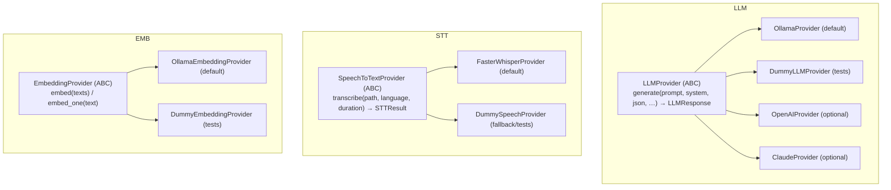
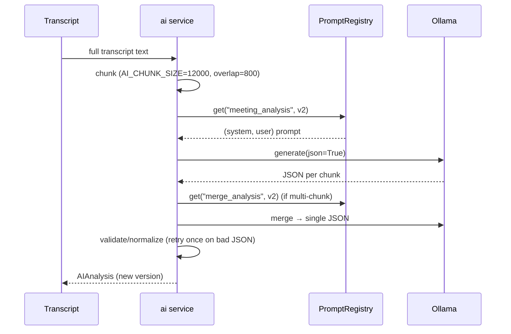
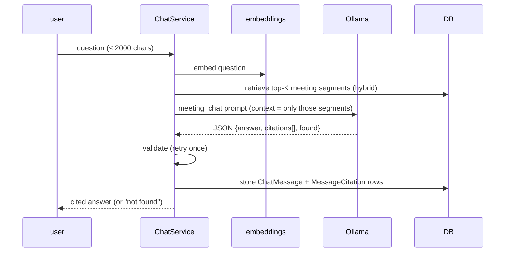

# MeetingMind AI — AI Architecture

How MeetingMind's AI works, end to end, entirely on local software. Companion:
[ARCHITECTURE.md](ARCHITECTURE.md), [DATABASE.md](DATABASE.md).

> **Principle:** every AI capability is grounded in retrieved evidence and reproducible.
> Nothing is invented; every answer is traceable to source segments/records and stamped with
> the provider, model, prompt version and knowledge version that produced it.

---

## 1. The local AI stack

| Capability | Engine (default) | Where configured |
|---|---|---|
| Speech-to-Text | Faster-Whisper `base` (CPU, int8) | `STT_PROVIDER`, `WHISPER_*` |
| LLM (analysis, chat, agents) | Ollama `llama3.2:3b` | `AI_PROVIDER`, `OLLAMA_*` |
| Embeddings (RAG) | Ollama `nomic-embed-text` | `EMBEDDING_PROVIDER`, `EMBEDDING_MODEL` |
| Audio extraction/normalisation | FFmpeg / ffprobe | `FFMPEG_BINARY`, `FFPROBE_BINARY` |

No component requires the network beyond `localhost`. Cloud providers (OpenAI, Anthropic) are
optional drop-ins behind the same interfaces.

## 2. Provider abstraction & fallback strategy

Three interfaces isolate the rest of the app from any specific model vendor:



**Factories** read a settings switch and return the concrete provider:
`get_llm_provider()`, `get_speech_provider()`, `get_embedding_provider()`.

**Fallback strategy (graceful, never silent):**
- **STT:** if `STT_PROVIDER=faster_whisper` but the library isn't installed, the factory logs a
  structured warning and returns `DummySpeechProvider` — the app keeps running rather than
  crashing on import.
- **LLM:** if a configured provider can't be constructed, the factory falls back to the local
  Ollama provider.
- **Tests:** `conftest.py` forces `AI_PROVIDER`/`STT_PROVIDER`/`EMBEDDING_PROVIDER = mock`, so
  the suite is deterministic and offline. The Dummy providers return stable, structured output
  (the Dummy embedder is a hashed bag-of-words at dim 64).

**Result types:**
- `LLMResponse(text, model, provider, inference_ms, raw)`
- `STTResult(segments, language, language_confidence, model, provider, duration)` where each
  `STTSegment(start, end, text, confidence, words[])` and `STTWord(start, end, word, probability)`.

## 3. Speech pipeline (Whisper)

Audio flows through the meeting pipeline before it ever reaches Whisper:

```mermaid
flowchart LR
    UP["upload"] --> VAL["validation<br/>(MIME, size, duration)"]
    VAL --> INS["media_inspection<br/>(ffprobe → MediaMetadata)"]
    INS --> EXT["audio_extraction<br/>(ffmpeg → wav)"]
    EXT --> NORM["audio_normalization<br/>(16 kHz mono PCM)"]
    NORM --> LANG["language_detection"]
    LANG --> STT["speech_to_text<br/>(Faster-Whisper)"]
    STT --> CLEAN["transcript_cleanup"]
    CLEAN --> SEG["segmentation → TranscriptSegment[]"]
    SEG --> STORE["store_transcript"]
```



- **Normalisation** targets `NORMALIZED_SAMPLE_RATE` (16 kHz) mono PCM — Whisper's preferred input.
- **Whisper** is configurable: `WHISPER_MODEL_SIZE` (`tiny`→`large-v3`), `WHISPER_DEVICE`,
  `WHISPER_COMPUTE_TYPE` (int8 default), `WHISPER_BEAM_SIZE` (5). Models cache under
  `WHISPER_DOWNLOAD_ROOT`.
- Output is stored as one `Transcript` (raw + cleaned text, language, avg confidence, timing)
  plus ordered `TranscriptSegment` rows with per-segment confidence. Re-transcription with a
  different model/language replaces the transcript (segments are hard-deleted and rebuilt).
- Segments are individually **editable**; `original_text` is preserved so edits can be restored.

## 4. LLM meeting analysis

A **single grounded inference** produces all structured artifacts (per project guidance: faster
and more internally consistent than many small calls).



- **Artifacts:** executive/detailed/bullet summaries, meeting minutes, action items, decisions,
  risks, issues, follow-ups, deadlines, keywords.
- **Chunking:** long transcripts are split (`AI_CHUNK_SIZE`/`AI_CHUNK_OVERLAP`) and merged with
  the `merge_analysis` prompt (map-reduce).
- **Robustness:** JSON is validated/normalised; one retry on malformed output, then a structured
  `ProcessingError`.
- **Versioned, never overwritten:** each run creates a new `AIAnalysis` (`version`, `is_current`)
  stamped with `provider`, `model_used`, `prompt_version`, `inference_ms`, `temperature`, `chunks`.

## 5. Embeddings & RAG

Retrieval feeds both single-meeting chat and org-wide chat.

- **Embeddings:** `OllamaEmbeddingProvider` calls Ollama's batch `/api/embed` (per-text
  `/api/embeddings` fallback). Vectors are stored locally (on `KnowledgeItem.embedding` for the
  org index; cached per meeting for chat). `cosine()` computes similarity.
- **Hybrid retrieval:** semantic (embedding cosine) + keyword + timestamp signals select the most
  relevant transcript segments/records; only those are sent to the LLM (`CHAT_RETRIEVAL_K`
  segments, `CHAT_HISTORY_TURNS` of prior conversation).

## 6. Meeting Chat (grounded, cited RAG)



- Answers come **only** from retrieved segments. If the answer isn't present, `found=false`
  and the assistant says it couldn't find the information — it does not hallucinate.
- Each citation (`MessageCitation`) links to a `TranscriptSegment` with `start_time`, so the UI
  can jump the transcript to the cited moment.
- Conversation memory is bounded to the last `CHAT_HISTORY_TURNS` turns; chat never crosses
  meetings.

## 7. Knowledge Hub (organizational memory)

Every AI-derived fact is indexed into a **bitemporal, event-sourced** store so the organisation
can be queried across meetings and across time.

- **`KnowledgeItem`** — a versioned fact (meeting/segment/summary/decision/task/issue/risk/
  report/project/person) with embedding, provenance (`speaker`, `source_start_time`,
  `occurred_at`), valid-time (`valid_from`/`valid_to`), transaction-time (`recorded_at`),
  `is_current`, and confidence scoring (`confidence`, `consensus_score`, `retrieval_score`,
  `confidence_breakdown`).
- **`KnowledgeEvent`** — immutable audit of every create/update/supersede/merge/reindex/reembed.
- **`KnowledgeRetrieval`** — provenance of every AI answer: what items, what scores, which model
  and prompt/knowledge version.
- **`KnowledgeVersion`** — per-owner monotonic snapshot number stamped on items and answers.
- **`EmbeddingVersion`** — which embedding model produced which vector (auditability + re-embed).

**Capabilities built on this:** org search, cross-meeting chat (`OrgChatView`), time-travel
(`as_of`), topic timelines, entity history, reliability scoring, and a decision-impact graph.

### Organizational reasoning
- **`KnowledgeConsensus`** (+ `KnowledgeConsensusRevision` history) caches the organisation's
  current stance on a topic (position, confidence, support/opposition, trend, stability) so
  expensive LLM reasoning isn't recomputed per request.
- **`KnowledgeConflict`** is a categorised registry of detected contradictions
  (technical/business/timeline/risk/…) that can be tracked to resolution.

## 8. Executive Intelligence

A materialised, explainable analytics layer:
- **Snapshots:** `OrganizationSnapshot` (rolls up `ProjectSnapshot`s) hold health score/status,
  workspace score, analytics, insights and knowledge freshness.
- **Normalised records:** `ExecutiveRecommendation` (dedup key, evidence, confidence, status
  lifecycle), `ExecutiveAlert` (typed, deduped, resolvable), `ExecutiveTrendPoint`
  (daily/weekly/monthly), `ExecutivePrediction` (heuristic horizon), `ExecutiveMetricSnapshot`
  (append-only time series), `ExecutiveExplanation` (the "Why?" behind each metric card).
- **Scope-limited materialisation:** driven off the event bus, only the changed project's
  snapshot + the org rollup are rebuilt.

## 9. Multi-Agent intelligence

Agents, planner and collaboration all sit on top of the Knowledge Hub and Executive layer via a
governed **Tool Registry** — see [ARCHITECTURE.md](ARCHITECTURE.md) §10–§12 for the framework,
planner phases/policies, and collaboration templates. AI-specific points:

- **Grounding is enforced by a validator.** Each `AgentRun` is scored for grounding, evidence,
  completeness and overall quality; ungrounded/empty answers are flagged.
- **Synthesis prompt** (`agent_synthesis`, v2) turns tool evidence into `{answer, reasoning,
  key_points, recommendations, next_actions, confidence, found}`.
- **Planner** uses `planner_intent` (v1) to pick agents + mode and `planner_merge` (v1) to fuse
  multi-agent findings; conflicts resolve against the consensus registry, never by invention.

## 10. Prompt management

Prompts are **versioned data**, not hardcoded strings, via a `PromptRegistry`
(`apps/meetings/prompts/`). Each `Prompt(name, version, system, template)` renders to a
`(system, user)` pair. Registered prompts:

| Prompt | Version | Purpose |
|---|---|---|
| `meeting_analysis` | v2 | All meeting artifacts in one JSON |
| `merge_analysis` | v2 | Merge partial analyses (long meetings) |
| `meeting_chat` | v1 | Cited Q&A over a single meeting |
| `workspace_report` | v1 | Reports/emails (per-type instructions injected) |
| `agent_synthesis` | v2 | Agent evidence → structured answer |
| `planner_intent` | v1 | Agent selection + mode |
| `planner_merge` | v1 | Merge multi-agent findings |

Because prompts are versioned and stamped onto every output (`prompt_version`), you can trace
exactly which prompt produced any stored answer, and evolve prompts without losing history.

## 11. Reproducibility & trust summary

Every AI output records the chain that produced it:

```
answer ──stamped with──▶ provider · model · prompt_version · knowledge_version
   │
   └── evidence ──▶ KnowledgeRetrieval / MessageCitation ──▶ source segments/records
```

Combined with the bitemporal index, this means any answer can be reconstructed and explained
after the fact — the foundation of MeetingMind's grounded, auditable AI.

---

## Cross-references
- Framework, planner, collaboration internals → [ARCHITECTURE.md](ARCHITECTURE.md)
- Model fields for every entity above → [DATABASE.md](DATABASE.md)
- Grounding / prompt-injection posture → [SECURITY.md](SECURITY.md)
- Model latencies & tuning → [PERFORMANCE.md](PERFORMANCE.md)
