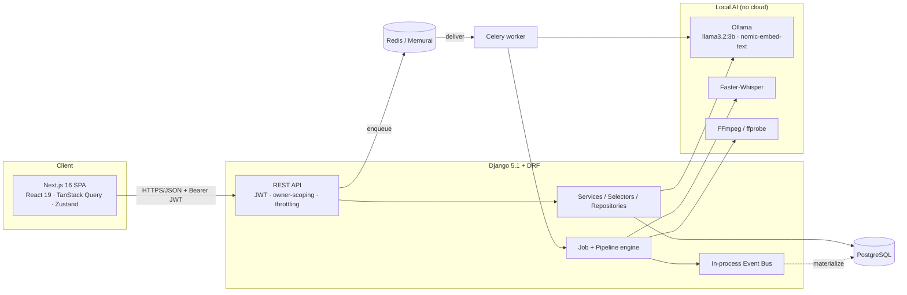
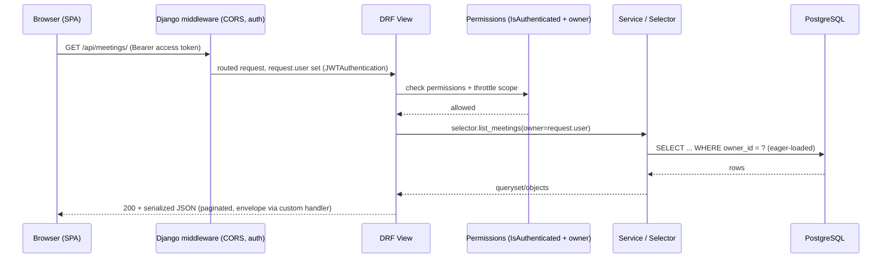
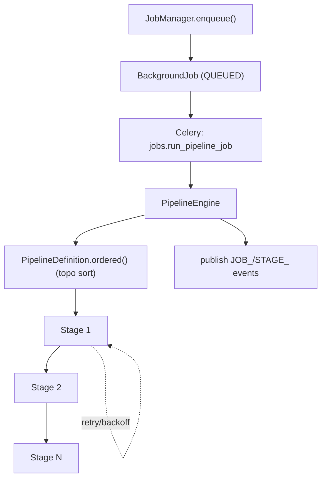
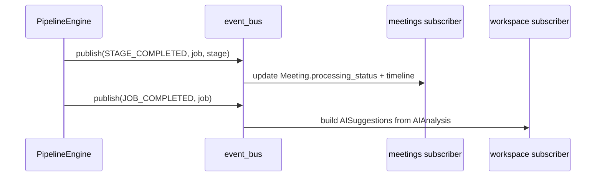
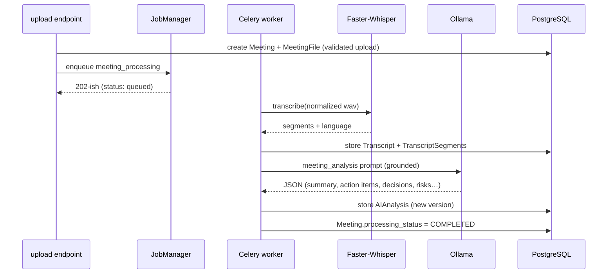
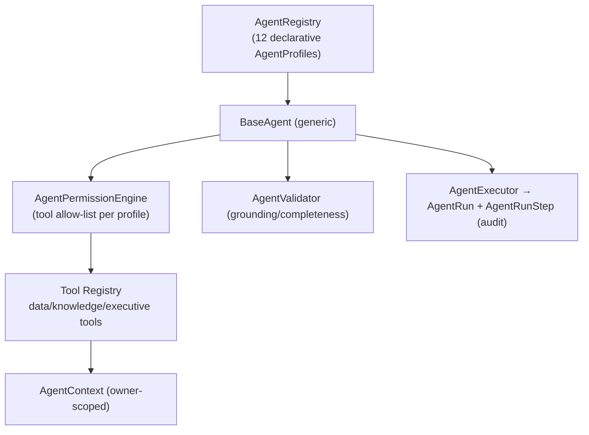
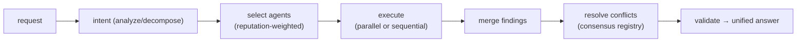

# MeetingMind AI — Architecture Guide

This document describes the system architecture of MeetingMind AI v1.0 as implemented.
Companion docs: [AI_ARCHITECTURE.md](AI_ARCHITECTURE.md), [DATABASE.md](DATABASE.md),
[API.md](API.md), [SECURITY.md](SECURITY.md).

---

## 1. Overall architecture

MeetingMind is a two-tier application: a **Next.js SPA** talking over JWT-authenticated
REST to a **Django/DRF backend**, with **Celery** running long jobs against a **PostgreSQL**
database, and **local AI services** (Ollama, Faster-Whisper) invoked from the worker.



- **Everything is owner-scoped.** Every authenticated request is filtered to `request.user`.
- **AI is abstracted.** All model calls go through provider interfaces (see §7).
- **Async is optional.** With `CELERY_TASK_ALWAYS_EAGER=True` the same pipeline runs inline
  (no Redis/worker), which is how the test suite and zero-dependency trials run.

## 2. Clean Architecture (layering)

Each Django app under `backend/apps/` follows the same internal layering. Dependencies point
**inward**: `api` depends on `services`/`selectors`; those depend on `models`; nothing points
back out to `api`.

```
apps/<app>/
├── api/
│   ├── urls.py           # routing
│   ├── views.py          # DRF views/viewsets — thin, orchestration only
│   └── serializers.py    # (de)serialization + input validation
├── services/             # business logic (side-effecting operations)
├── selectors.py          # read queries (owner-scoped, eager-loaded)
├── repositories.py       # persistence helpers (where present)
├── models.py             # ORM entities
├── tasks.py              # Celery task entrypoints (where present)
└── enums.py              # choices / status enums
```

| Layer | Responsibility | Rule |
|---|---|---|
| **api** | HTTP boundary: auth, permissions, (de)serialization, status codes | No business logic; delegates to services/selectors |
| **services** | Business operations, transactions, AI orchestration | The only layer that writes non-trivial state |
| **selectors** | Read paths | Always owner-scoped; use `select_related`/`prefetch_related` |
| **models** | Persistence, invariants, versioning, soft-delete | No knowledge of HTTP |
| **tasks/pipeline** | Async execution | Idempotent, resumable, retry-aware |

This separation is what keeps the AI provider swap, the async/eager swap, and owner-scoping
uniform across all seven apps (`common`, `accounts`, `jobs`, `meetings`, `workspace`,
`knowledge`, `agents`).

## 3. Request lifecycle



- **Auth:** `rest_framework_simplejwt.authentication.JWTAuthentication` (Bearer header).
- **Permissions:** default `IsAuthenticated`; per-view owner permissions (`IsOwner`,
  `OwnsMeeting`, `IsJobOwnerOrAdmin`).
- **Errors:** `apps.common.exceptions.custom_exception_handler` produces a consistent envelope.
- **Pagination:** `apps.common.pagination.DefaultPagination` (page size 20).
- **On 401**, the SPA transparently refreshes the access token and retries.

## 4. Background jobs & the pipeline engine

The `apps/jobs` app is a **domain-agnostic** execution engine. Meetings (and any future
OCR/export/email work) plug into it rather than reinventing async orchestration.

Key building blocks:
- **`BackgroundJob`** — the tracked unit of work: `status`, `priority`, `progress`,
  `current_stage`, `queue_name`, `attempts`/`max_attempts`, `payload`/`result`, timing,
  and a cooperative `locked_at`/`locked_by` lock.
- **`Stage` (ABC)** — one idempotent, retryable step; self-registers via `@register_stage`
  into the `stage_registry`.
- **`PipelineDefinition`** — a named set of stages plus a dependency DAG; `.ordered()` does a
  Kahn topological sort. Registered in the `pipeline_registry`.
- **`PipelineEngine`** — runs stages in order, handles retries (per-stage exponential backoff),
  cancellation (`CancellationToken`), idempotent resume (skips `completed_stages`), and
  publishes lifecycle events.
- **`JobManager`** — the single seam over Celery: `enqueue`, `dispatch`, `cancel`, `retry`,
  `pause`, `resume`, `requeue`. The `@shared_task jobs.run_pipeline_job` is the Celery entry.

Queues (kombu): `default`, `media`, `ai`, `exports`, `notifications`, `maintenance`
(priority-aware; `acks_late`, `reject_on_worker_lost`, prefetch = 1).



The meeting pipeline (`meeting_processing`) has 12 stages:
`validation → media_inspection → audio_extraction → audio_normalization →
language_detection → speech_to_text → transcript_cleanup → transcript_segmentation →
store_transcript → ai_analysis → store_ai_results → finalize`. A lighter `ai_summarization`
pipeline (`ai_analysis → store_ai_results → finalize`) re-runs AI over an existing transcript.

## 5. Event Bus

`apps/jobs/events.py` provides a process-wide **in-process** `event_bus`:
- `subscribe(event, handler)` / `publish(event, **payload)` / `clear()`; `*` subscribes to all.
- Handlers run synchronously in the worker; exceptions are logged, never re-raised (a bad
  subscriber can't fail the job).

Lifecycle events (`JobEvent`): `JOB_CREATED`, `JOB_QUEUED`, `JOB_STARTED`, `STAGE_STARTED`,
`STAGE_COMPLETED`, `STAGE_FAILED`, `STAGE_SKIPPED`, `JOB_RETRY`, `JOB_CANCELLED`,
`JOB_COMPLETED`, `JOB_FAILED`.

Subscribers decouple side effects from the pipeline:
- **meetings** bridges job/stage events → `Meeting.processing_status` + `MeetingEvent` timeline.
- **workspace** subscribes to `JOB_COMPLETED` → materialises AI suggestions from the analysis.
- **knowledge/executive** rematerialises the affected scope (see §9, §10).



## 6. Provider abstraction

The local-first mandate is enforced by three interfaces, each with a factory that reads a
settings switch:

| Interface | Factory | Default | Alternatives |
|---|---|---|---|
| `LLMProvider` | `get_llm_provider()` | `OllamaProvider` | Dummy (tests), OpenAI, Claude |
| `SpeechToTextProvider` | `get_speech_provider()` | `FasterWhisperProvider` | Dummy (auto-fallback) |
| `EmbeddingProvider` | `get_embedding_provider()` | `OllamaEmbeddingProvider` | Dummy |

This is textbook **Dependency Inversion**: business services depend on the interface, never on
Ollama/Whisper directly. Swapping a provider is an env change, and tests force `mock` providers
so the suite is deterministic and offline. Details in [AI_ARCHITECTURE.md](AI_ARCHITECTURE.md).

## 7. Pipeline engine (meetings) — end to end



## 8. Knowledge Hub

A **bitemporal, event-sourced** index (`apps/knowledge`). AI-derived facts become
`KnowledgeItem` rows that are *versioned* and carry both **valid time** (`valid_from`/`valid_to`)
and **transaction time** (`recorded_at`), with `is_current` for the live view. Every change
appends an immutable `KnowledgeEvent`; retrievals are logged as `KnowledgeRetrieval` for
provenance. `KnowledgeVersion` gives each owner a monotonic snapshot number stamped onto items
and AI answers for reproducibility. Reasoning layers add `KnowledgeConsensus`
(+`Revision` history) and a categorised `KnowledgeConflict` registry.

This is what powers org-wide search, cross-meeting chat, time-travel, topic timelines,
reliability scoring, and consensus/conflict views. Design detail: [DATABASE.md](DATABASE.md) §Knowledge.

## 9. Executive Intelligence

A **materialised** analytics layer (`apps/knowledge`, executive models). Rather than
recomputing dashboards per request, snapshots are built and stored:
`OrganizationSnapshot` (top scope) rolls up `ProjectSnapshot`s; `ExecutiveRecommendation`,
`ExecutiveAlert`, `ExecutiveTrendPoint`, `ExecutivePrediction`, `ExecutiveMetricSnapshot` and
`ExecutiveExplanation` are normalised, explainable records.

Materialisation is **scope-limited**: a change to one project rematerialises that
`ProjectSnapshot` plus the org rollup — not the entire workspace — driven off the event bus.
The dashboard endpoint serves the snapshot (with an optional `?refresh=` to force a rebuild).

## 10. Agent Framework

`apps/agents` implements a declarative multi-agent platform.



- **Agents are data, not classes.** An `AgentProfile` (role, allowed tools, prompt) plus the
  generic `BaseAgent` avoids per-agent subclasses. 12 profiles ship (executive, project_manager,
  technical_architect, qa, risk_analyst, business_analyst, documentation, meeting_analyst,
  knowledge, report_generator, research, customer_success).
- **Tool Registry is the only data path.** Agents cannot touch the ORM directly; every read goes
  through a tool that resolves data via the owner-scoped `AgentContext`. The
  `AgentPermissionEngine` enforces that an agent may only call tools declared in its profile
  (least privilege).
- **Every run is audited.** `AgentExecutor` persists an `AgentRun` (with quality/observability
  scores) and per-step `AgentRunStep` rows (`TOOL_CALL`/`SYNTHESIZE`/`VALIDATE`/`PLAN`).
- **Sandbox mode** runs an agent without persisting side effects.

## 11. Planner

The Planner (`apps/agents/planner`) turns a request into an orchestrated multi-agent plan:



Phases (`PlannerPhase`): `ANALYZE → DECOMPOSE → SELECT → EXECUTE → MERGE → RESOLVE → VALIDATE`,
each recorded as a `PlannerStep`. Five **execution policies** (in `planner/policies.py`) trade
breadth for latency:

| Policy | Agents | Bias | Mode | Timeout |
|---|---|---|---|---|
| `LOWEST_LATENCY` | 2 | latency | parallel | 20 s |
| `FAST` | 2 | latency | parallel | 25 s |
| `BALANCED` (default) | 3 | balanced | merge-LLM | 40 s |
| `HIGHEST_QUALITY` | 5 | quality | merge-LLM | 60 s |
| `RESEARCH` | 6 | quality | merge-LLM | 90 s |

A `PlannerRun` records the intent, selected agents, unified answer, quality/observability
metrics, and a human-approval gate (`requires_approval`/`approved`). The run endpoint is
declared `non_atomic_requests` so worker threads see committed rows.

## 12. Collaboration

The Collaboration engine (`apps/agents/collaboration`) runs **multi-agent workflows** over a
shared tool-result cache (agents reuse each other's tool calls). Stage types:
`PRODUCE`, `HANDOFF`, `REVIEW`, `VOTE`, `DEBATE`, `CONSENSUS`, `HUMAN_GATE`, `MERGE`.
Seven `WorkflowTemplate`s ship:

| Template | Shape |
|---|---|
| `sprint_planning` | PM + Risk propose → QA reviews (review-required) |
| `executive_review` | Executive + Risk + PM assess in parallel |
| `release_readiness` | QA + Risk assess → vote to release (consensus) |
| `risk_assessment` | Risk identifies → Architect + QA review |
| `architecture_review` | Architect proposes → QA + Risk review → Architect + Research debate |
| `customer_feedback` | Customer Success + Business Analyst analyse in parallel |
| `incident_postmortem` | Meeting Analyst → Risk → Documentation handoff chain |

`CollaborationRun`/`CollaborationStep` persist the workflow, per-stage outputs, reviews, votes,
collaboration-quality metrics, and an optional human-approval gate.

## 13. Frontend architecture (brief)

Next.js 16 App Router with two route groups: `(auth)` (login/register/reset) and `(dashboard)`
(the app shell). Data fetching is **TanStack Query** (caching, retries, background refetch);
light client state is **Zustand**; forms use **react-hook-form + zod**; styling is **Tailwind 4**.
The API client attaches the Bearer token and transparently refreshes on 401. Route-level error
boundaries + skeleton loaders cover loading/error states; accessibility notes live in
`frontend/docs/ACCESSIBILITY.md`.

---

## Cross-references
- Data model & ER diagram → [DATABASE.md](DATABASE.md)
- AI subsystems, RAG, prompts, fallback → [AI_ARCHITECTURE.md](AI_ARCHITECTURE.md)
- Endpoint reference → [API.md](API.md)
- Security model → [SECURITY.md](SECURITY.md)
- Performance characteristics → [PERFORMANCE.md](PERFORMANCE.md)
