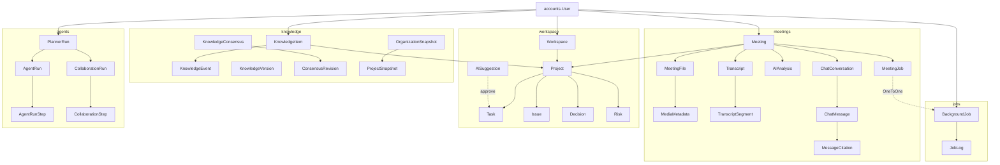
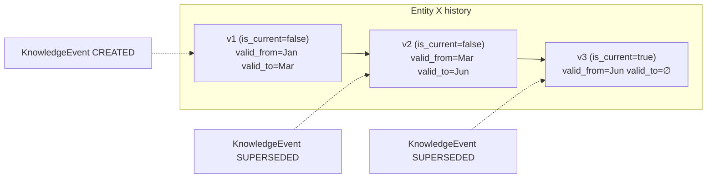

# MeetingMind AI — Database Guide

The MeetingMind data model: ~68 models across 7 apps, unified by a small set of abstract base
classes and three persistence patterns — **soft-delete + audit**, **versioning**, and a
**bitemporal, event-sourced** knowledge index. Companion: [ARCHITECTURE.md](ARCHITECTURE.md),
[AI_ARCHITECTURE.md](AI_ARCHITECTURE.md).

Database: **PostgreSQL** (`django.db.backends.postgresql`); SQLite is a supported fallback
(`DB_ENGINE=sqlite`) for quick trials.

---

## 1. Abstract base classes (`apps.common.models`)

Almost every concrete model inherits `BaseModel`, which composes four mixins:

| Base | Fields it adds | Purpose |
|---|---|---|
| `UUIDModel` | `id` (UUIDv4 PK, non-editable) | No sequential IDs ever exposed |
| `TimeStampedModel` | `created_at` (indexed), `updated_at` | Lifecycle timestamps |
| `AuditModel` | `created_by`, `updated_by` (FK→User, SET_NULL) | Who created/changed the row |
| `SoftDeleteModel` | `is_deleted` (indexed), `deleted_at` + managers `objects` / `all_objects` | `.delete()` soft-deletes; `hard=True` for permanent |
| **`BaseModel`** | all of the above; `Meta.ordering = ("-created_at",)` | Canonical base for domain models |

Two app-level bases extend this:
- **`OwnedModel`** (workspace) → adds `owner` (FK→User, CASCADE). Every workspace row is owner-scoped.
- **`AISourcedModel`** (workspace, extends `OwnedModel`) → adds AI provenance: `meeting`,
  `created_by_ai`, `confidence`/`confidence_score`, `source_segment_index`, `source_start_time`,
  `source_speaker`, `source_quote`, `source_reason`, `suggestion`.
- **`_SnapshotBase`** (knowledge) → adds `snapshot_version`, `knowledge_version`,
  `consensus_version`, `generated_at`, `generated_by`, `processing_ms` to executive snapshots.

> **`User`** is the exception: it extends Django's `AbstractBaseUser` + `PermissionsMixin`
> (UUID PK, `email` as username, own soft-delete via `is_deleted`/`deleted_at`), not `BaseModel`.

## 2. App relationships (high level)



Cardinality highlights: a `User` owns many meetings/jobs/workspaces/knowledge-items/runs; a
`Meeting` has many files/transcripts/segments/analyses/conversations; `MeetingJob` is a
**OneToOne** bridge to the generic `BackgroundJob`; approving an `AISuggestion` materialises a
real `Task`/`Issue`/`Decision`/`Risk`/`FollowUp`.

## 3. Entity descriptions by app

### accounts
- **User** — UUID PK, unique indexed `email` (username field), `first_name`/`last_name`,
  `is_active`/`is_staff`, soft-delete, `date_joined`. `full_name` property; `soft_delete()`
  deactivates rather than removing.
- **PasswordResetToken** — `user` FK, `token_hash` (SHA-256 only; raw never stored),
  `expires_at`/`used_at`; `is_valid()`/`mark_used()`; 1-hour TTL.

### meetings
- **Meeting** — the aggregate root: `owner`, optional `project`, `title`/`description`,
  `language`, `source`, `processing_status`, `is_archived`, `duration_seconds`, `tags`.
  Indexes: `(owner, processing_status)`, `(owner, -created_at)`. `current_file` property.
- **MeetingFile** — versioned upload (`version`, `is_current`), storage metadata
  (`storage_key`, `original_filename`, `stored_filename`, `checksum_sha256`, `size_bytes`,
  `content_type`, `media_kind`), `upload_status`, `validation_report`. **Unique** `(meeting,
  version)`; index `(meeting, is_current)`. Re-uploads add versions; history is kept.
- **MediaMetadata** — OneToOne to a file: container/codecs/bitrate/sample_rate/channels/
  frame_rate/width/height + `extra` probe JSON.
- **MeetingJob** — OneToOne bridge `Meeting ↔ jobs.BackgroundJob` (decouples the domain from the
  generic engine).
- **UploadSession** — foundation for chunked/resumable uploads (status, byte/chunk counters,
  checksum, expiry).
- **MeetingEvent** — rich timeline entry (`event_type`, `source`, `message`, `details`,
  `duration_ms`); index `(meeting, created_at)`.
- **Transcript** — one per current file: `raw_text`/`clean_text`, counts, `detected_language`/
  `language_confidence`/`avg_confidence`, `model_used`/`provider`/`processing_ms`, edit flags.
  `transcription_speed` property.
- **TranscriptSegment** — ordered segment (`index`, `start_time`, `end_time`, `speaker`, `text`,
  `original_text` for restore, `confidence`). **Unique** `(meeting, index)`.
- **AIOutput** — generic per-meeting AI artifact keyed by `kind`; **unique** `(meeting, kind)`;
  `current_output` prefers edited over raw.
- **ProcessingLog** — immutable per-stage audit (`stage`, `status`, `duration_ms`), links back to
  the `BackgroundJob`.
- **AIAnalysis** — the versioned meeting analysis (`version`, `is_current`) holding all artifacts
  (summaries, minutes, action_items, decisions, risks, issues, follow_ups, deadlines, keywords)
  plus model/prompt provenance. **Unique** `(meeting, version)`; index `(meeting, is_current)`.
- **ChatConversation / ChatMessage / MessageCitation** — a chat thread scoped to one meeting; each
  assistant message carries `found` and grounded `MessageCitation` rows linking to
  `TranscriptSegment` (with `start_time` for jump-to-transcript).

### jobs
- **BackgroundJob** — domain-agnostic unit of work: `job_type`, `pipeline`, `status`, `priority`,
  `progress`, `current_stage`, `queue_name`, `worker_id`, `payload`/`result`/`metadata`,
  `attempts`/`max_attempts`, timing, and a cooperative `locked_at`/`locked_by` lock. Indexes:
  `(job_type, status)`, `(status, priority, created_at)`, `(pipeline, status)`. Rich state
  methods (`mark_running`, `set_progress`, `mark_succeeded/failed`, `request_cancellation`,
  `pause`/`resume`).
- **JobLog** — structured per-stage log line (`level`, `message`, `progress`, `duration_ms`);
  indexes `(job, created_at)`, `(job, stage)`.

### workspace
Human-in-the-loop productivity suite. Hierarchy **Workspace → Project → (Meeting) → items**.
- **Workspace / Project / Milestone** — containers; Project has a `status` lifecycle.
- **Task** (`AISourcedModel`) — Kanban card: `status` (todo/in_progress/in_review/done/blocked/
  cancelled), `priority`, `category`, `labels`/`watchers`/`checklist`/`dependencies` (JSON),
  `due_date`, `estimated_minutes`, `order`. Indexes `(owner, status)`, `(meeting)`.
- **Issue / Decision / Risk / FollowUp** (`AISourcedModel`) — typed work items, each with its own
  status enum; all carry AI provenance so an approved suggestion is traceable to a transcript
  moment.
- **Note / Report / Notification** (`OwnedModel`) — Report is versioned (`version`, `is_current`)
  with model/prompt provenance.
- **AISuggestion** — the human-in-the-loop gate: a pending AI-extracted item (`suggestion_type`,
  `status`, `confidence`/`confidence_score`, `original_json` immutable + `edited_json`,
  provenance quote/speaker/segment). On approval it materialises a real record and records
  `converted_to_type`/`converted_to_id`; nothing is deleted (full audit trail). Ordered by
  `(-confidence_score, -created_at)`; indexes `(owner, status)`, `(meeting, status)`.
- **TaskComment / TaskAttachment / ActivityLog** — collaboration + a workspace-wide activity feed.

### knowledge
The bitemporal, event-sourced index (see §4) plus reasoning and executive layers.
- **KnowledgeItem** — versioned fact with embedding, provenance, valid/transaction time,
  `is_current`, confidence scoring. Custom manager (`.current()`, `.as_of(when)`). Heavily
  indexed and constrained (see §4).
- **KnowledgeEvent / KnowledgeRetrieval / KnowledgeVersion / EmbeddingVersion** — audit stream,
  retrieval provenance, per-owner snapshot number, and embedding-model registry.
- **KnowledgeConsensus / KnowledgeConsensusRevision / KnowledgeConflict** — cached organisational
  stance with revision history, and a categorised conflict registry (open→resolved lifecycle).
- **OrganizationSnapshot / ProjectSnapshot** — materialised health/score views (`_SnapshotBase`).
- **ExecutiveRecommendation / ExecutiveExplanation / ExecutiveTrendPoint / ExecutivePrediction /
  ExecutiveMetricSnapshot / ExecutiveAlert** — normalised, explainable executive records; the
  metric snapshot is an append-only time series powering trends and predictions.

### agents
Only **runs** persist (agents themselves are declarative in-code; no duplicated business data).
- **AgentRun / AgentRunStep** — a single agent execution with quality scores (grounding,
  evidence, completeness, overall) and observability (latencies, retries, token usage,
  validation), broken into ordered steps.
- **PlannerRun / PlannerStep** — an orchestrated multi-agent run: intent, selected agents,
  unified answer, quality + observability metrics, and a human-approval gate.
- **CollaborationRun / CollaborationStep** — a multi-agent workflow (produce/handoff/review/vote/
  debate) with collaboration-quality metrics and an approval gate; may link to a `PlannerRun`.

## 4. Bitemporal, event-sourced Knowledge index

`KnowledgeItem` is the heart of the Knowledge Hub and the most carefully modelled table.

**Two time axes (bitemporality):**
- **Valid time** — `valid_from` / `valid_to`: when the fact was true in the world.
- **Transaction time** — `recorded_at`: when the system learned it.
- **`is_current`** marks the live row for fast "now" queries.

**Versioning & supersession:** `version` (per entity), `supersedes_version`, `change_source`
(`INITIAL`/`MEETING_REINDEX`/`AI_SUGGESTION`/`MANUAL_EDIT`/`MERGE`/`SPLIT`/`REEMBED`),
`change_reason`, `changed_by`. Nothing is updated in place — a change writes a **new version** and
appends a **`KnowledgeEvent`**.

**Time-travel query** (custom manager):
```python
KnowledgeItem.objects.as_of(when)   # valid_from <= when AND (valid_to IS NULL OR valid_to > when)
KnowledgeItem.objects.current()     # is_current = True
```

**Integrity constraints:**
- `UniqueConstraint(owner, entity_type, entity_id, version)` — one row per version.
- `UniqueConstraint(owner, entity_type, entity_id)` **where** `is_current AND NOT is_deleted` —
  at most one current row per entity.

**Indexes** (owner-first, matching access patterns): `(owner, entity_type)`, `(owner, meeting)`,
`(owner, project)`, `(owner, -occurred_at)`, `(owner, is_current)`,
`(owner, entity_type, entity_id, -version)`, `(owner, valid_from, valid_to)`.



## 5. Cross-cutting patterns

| Pattern | Where | Mechanism |
|---|---|---|
| **Soft delete** | all `BaseModel` descendants + `User` | `is_deleted`/`deleted_at`; `objects` hides deleted, `all_objects` sees all; `hard=True` for permanent |
| **Audit fields** | all `BaseModel` descendants | `created_by`/`updated_by`, `created_at`/`updated_at` |
| **Owner scoping** | workspace, knowledge, agents (+ meetings via `owner`) | `owner` FK; every selector filters on it |
| **Versioning** | `MeetingFile`, `AIAnalysis`, `KnowledgeItem`, `Report` | `version` + `is_current`, unique `(scope, version)` |
| **Bitemporal** | `KnowledgeItem` | valid-time + transaction-time + `as_of()` |
| **Event sourcing / audit stream** | `KnowledgeEvent`, `MeetingEvent`, `ProcessingLog`, `JobLog`, `ActivityLog`, `AgentRunStep`/`PlannerStep`/`CollaborationStep` | append-only rows |
| **Materialised views** | executive snapshots + metric time series | rebuilt scope-limited via the event bus |
| **AI explainability** | `AISourcedModel`, `AISuggestion`, `AgentRun`, `PlannerRun`, `CollaborationRun` | confidence + source/provenance + reasoning |

## 6. Constraints & indexing summary

- **UUID primary keys** everywhere (no enumeration/scraping of sequential IDs).
- **Unique constraints** protect versioning invariants (file/analysis/knowledge versions) and
  dedup keys (executive recommendations/alerts, consensus/conflict per topic, embedding versions).
- **Owner-first composite indexes** back the owner-scoped read paths across meetings, knowledge,
  jobs, workspace and agents — the project ships **hundreds** of index declarations tuned to the
  `WHERE owner = ? AND …` shape that dominates queries.
- **JSONField** is used for flexible, non-relational payloads (tags, checklists, evidence,
  results, confidence breakdowns); date-bearing JSON uses `DjangoJSONEncoder`.

## 7. Migrations

Standard Django migrations per app (`apps/<app>/migrations/`). Apply with:
```bash
venv/Scripts/python.exe manage.py migrate
```
See [DEPLOYMENT.md](DEPLOYMENT.md) for the production migration strategy and
[PRODUCTION_READINESS.md](PRODUCTION_READINESS.md) for backup/restore around migrations.

---

## Cross-references
- How these tables are read/written → [ARCHITECTURE.md](ARCHITECTURE.md)
- Knowledge/embedding semantics → [AI_ARCHITECTURE.md](AI_ARCHITECTURE.md)
- Endpoints that expose them → [API.md](API.md)
