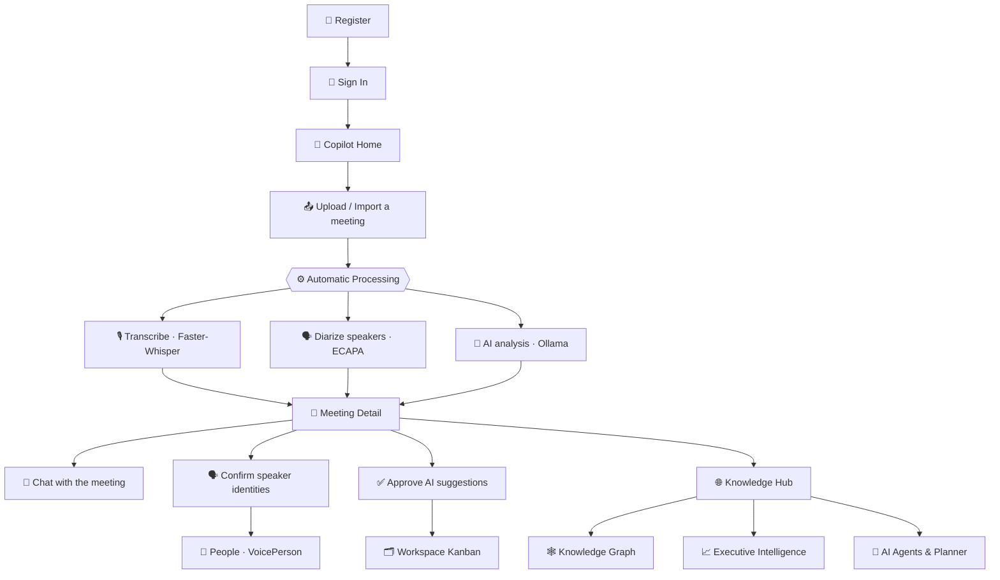
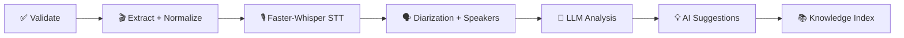

# 🧭 MeetingMind AI — Complete Workflow & App Walkthrough

**From creating an account to organization-wide intelligence — the full journey.**

---

## 🗺️ The Complete Journey

> 💡 **Prefer a guided tour?** On first sign-in, MeetingMind offers a built-in **30-second guided tour** that walks you through the product. You can restart it anytime from **Settings**.

---

## 1️⃣ Register & Sign In

Create an account and sign in. Authentication is JWT-based, and **every piece of data is owner-scoped** — you only ever see your own meetings, tasks and knowledge.

**➡️ Next:** you land on the **Copilot** home.

---

## 2️⃣ Copilot — Your AI Workspace Home

The Copilot is the command center: a time-of-day greeting, your **Workspace Score**, priority tiles (recommendations, open alerts, new decisions/risks), and an **Ask the Copilot** box. Press <kbd>Ctrl</kbd>/<kbd>⌘</kbd> + <kbd>K</kbd> anywhere for the **Command Palette**.

---

## 3️⃣ Upload or Import a Meeting

Add a recording three ways — all funnel into the **same real pipeline**:

- **Upload** an audio/video file (drag & drop, multi-file queue)
- **Import from a URL** — YouTube/Vimeo, a direct MP3/MP4, or a podcast/RSS feed
- **Try a sample** recording from the demo library

**➡️ Next:** MeetingMind processes it automatically.

---

## 4️⃣ Automatic Processing

A resumable, idempotent pipeline runs end-to-end — you watch it live on the meeting's **Processing timeline**:

Everything runs **locally** — no audio ever leaves your machine.

---

## 5️⃣ Meeting Detail — Everything You Get

When processing completes, the meeting page shows the full result set:

- **Transcript** — word-level, speaker-attributed, editable, with clickable timestamps
- **Speakers** — first-class speaker cards with talk-time and **cross-meeting identity** links
- **AI Insights** — executive summary, key points, action items, decisions, risks, follow-ups, keywords
- **Chat** — ask grounded, cited questions about the meeting
- **Processing timeline** + file/media details

---

## 6️⃣ Meetings Library

All your meetings in one place — searchable, filterable, with status, duration, source and quick actions (star, favorite, delete).

---

## 7️⃣ Speaker Identity — People

MeetingMind recognizes the **same voice across meetings**. Confirm a speaker once and it becomes a **VoicePerson** identity; future meetings suggest *"Looks like Alex Rivera — 96% · Highly likely"* (suggestion-only — you always confirm). Each identity rolls up talk-time and presence analytics.

---

## 8️⃣ Workspace — Approve AI Into Action

AI never auto-creates tasks. It **suggests** tasks / decisions / risks with evidence and confidence; you **approve** them into a real **Kanban** board (drag-and-drop, comments, activity log).

---

## 9️⃣ Knowledge Hub — Organizational Memory

Every fact is indexed into a **bitemporal, event-sourced** Knowledge Hub. Search across all meetings, ask **cross-meeting questions**, time-travel ("what did we know as of…"), and inspect the **Knowledge / People Graph**.

<table>
<tr>
<td align="center" width="50%"><b>Org Search & Chat</b></td>
<td align="center" width="50%"><b>Knowledge Graph</b></td>
</tr>
<tr>
<td></td>
<td></td>
</tr>
</table>

---

## 🔟 Executive Intelligence

A materialized executive layer turns everything into decisions: **workspace health & score**, analytics & leaderboards, explainable **recommendations**, lifecycle **alerts**, trends, predictions, and generated **briefs**.

---

## 1️⃣1️⃣ AI Agents, Planner & Collaboration

A team of **12 specialized AI agents** work over a governed Tool Registry. A **Planner** composes them (5 execution policies), and a **Collaboration** engine runs multi-agent workflows — all explainable and grounded in your data.

---

## 1️⃣2️⃣ Settings, Dark Mode & Mobile

Manage appearance (light / dark / system), preferences, and view system status. The whole app is responsive and ships a polished dark theme.

<table>
<tr>
<td align="center" width="40%"><b>Settings</b></td>
<td align="center" width="40%"><b>Dark Mode</b></td>
<td align="center" width="20%"><b>Mobile</b></td>
</tr>
<tr>
<td></td>
<td></td>
<td></td>
</tr>
</table>

---

**That's the full loop** — sign up, add a meeting, and MeetingMind turns it into transcripts, decisions, identities, knowledge and executive insight, entirely on your own machine.

⬅️ Back to the [main README](../README.md)

